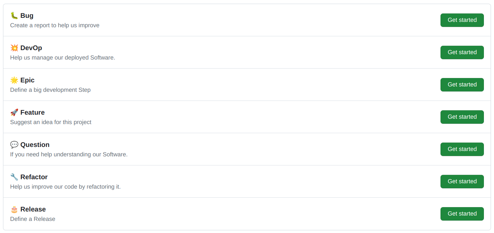

# issue-templates

This repository keeps track of the issue templates I developed over time and throughout different projects and teams.

The Templates follow simple guidelines to improve the workflow of the developers
- Simple, easy & comprehensible - not overloaded with massive amount of info
- Have visual cues using emoji icons to make it easier to identify contents
- Limited to 7 different templates covering most use cases for small teams

This Repo also includes a Pullrequest template.

## Labels

Furthermore 7 different labels are defined, one for each Issue template. The use is optional, but if you intend to use them you have to create them manually in your repository. Those labels are:
- bug
- devops
- epic
- feature
- question
- refactor
- release

## Preview

The screen choosing the template looks like this:

Below each Issue template is shown, when submitted empty

### Bug Report

See: https://github.com/ulfgebhardt/issue-templates/issues/1

### DevOps Ticket

See: https://github.com/ulfgebhardt/issue-templates/issues/2

### Epic

See: https://github.com/ulfgebhardt/issue-templates/issues/3

### Feature Request

See: https://github.com/ulfgebhardt/issue-templates/issues/4

### Question

See: https://github.com/ulfgebhardt/issue-templates/issues/5

### Refactor Ticket

See: https://github.com/ulfgebhardt/issue-templates/issues/6

### Release

See: https://github.com/ulfgebhardt/issue-templates/issues/7

### Pullrequest

See: https://github.com/ulfgebhardt/issue-templates/pull/8